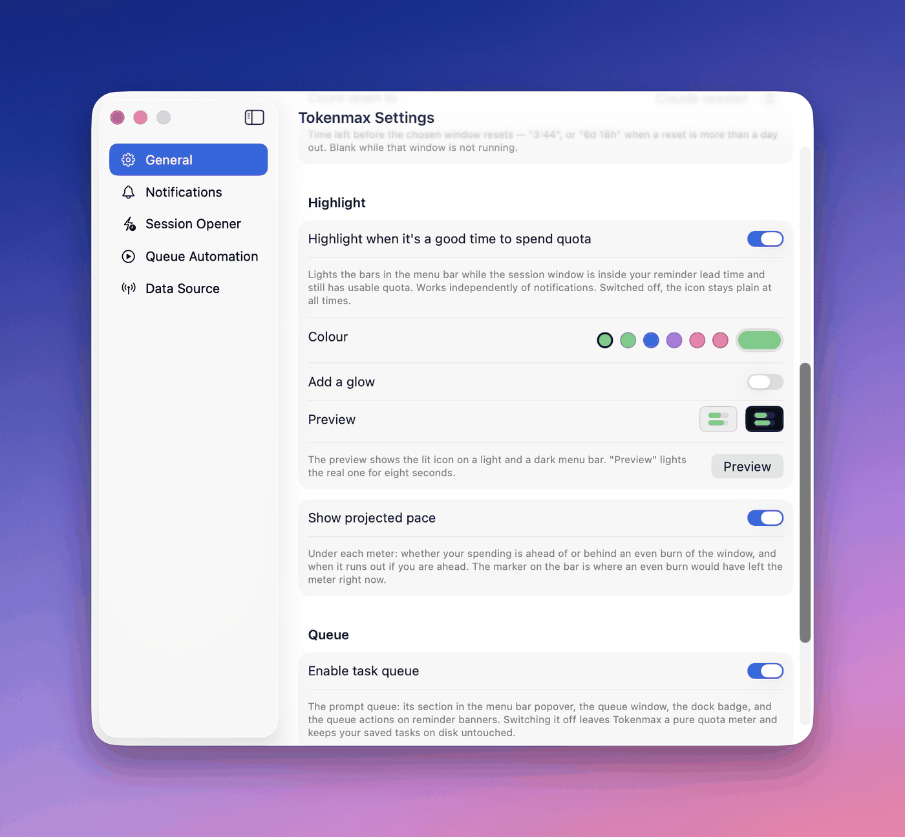
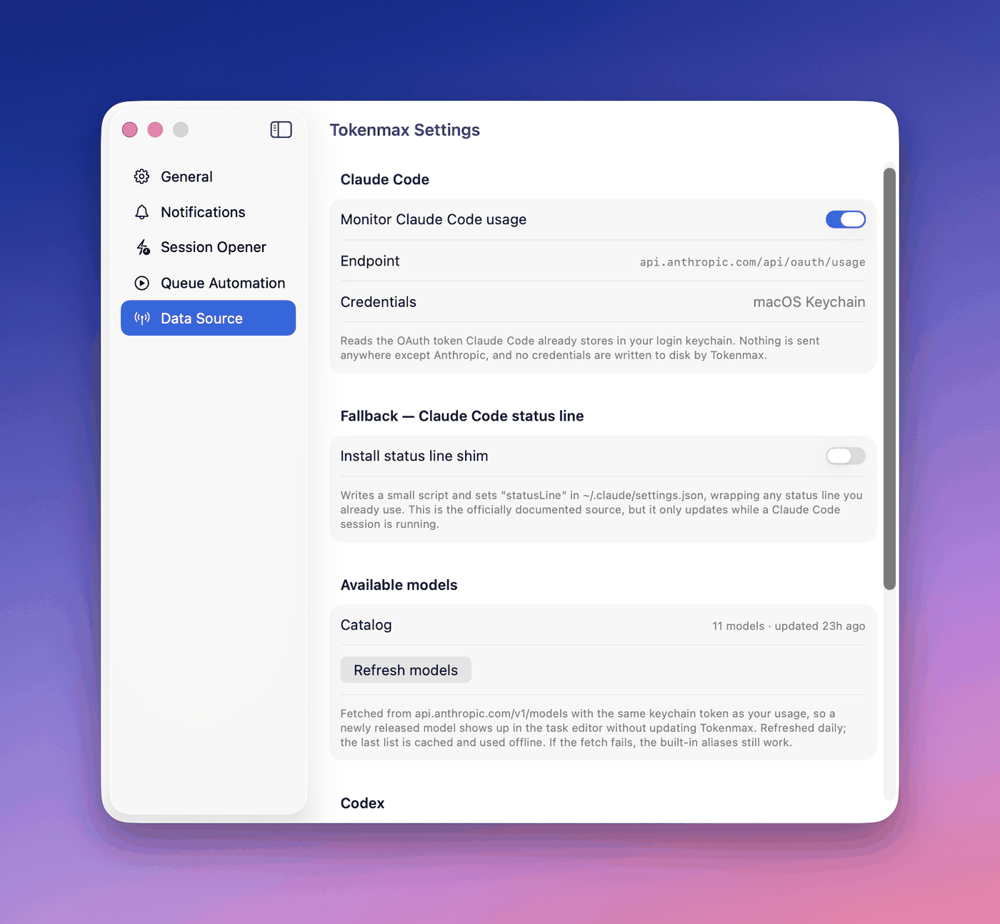
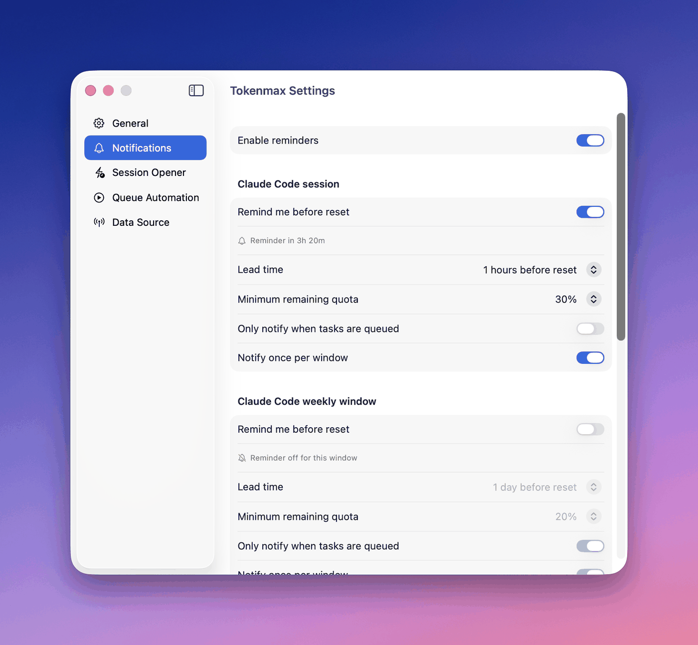
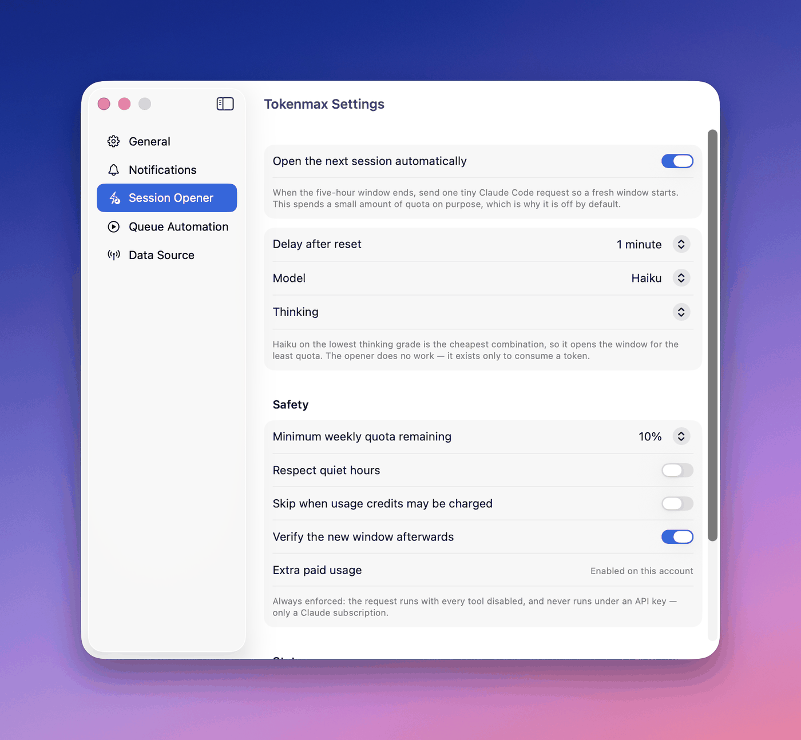
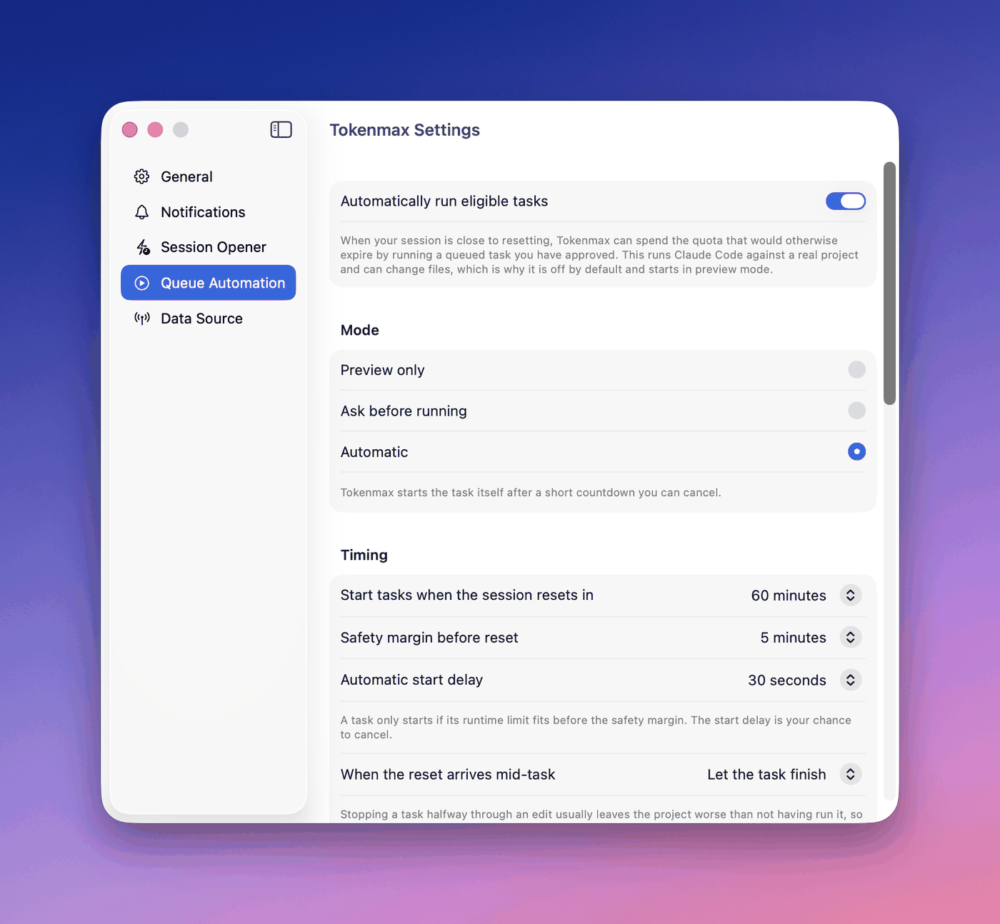

# Tokenmax 0.1

A macOS menubar app that shows remaining Claude Code and Codex quota, counts down to reset,
projects whether your current pace runs out early or leaves quota on the table, keeps a local
prompt queue, and notifies you before a window resets so leftover quota gets used instead of
evaporating.

<p align="center">
  
</p>

## What it does

- **Two providers in one meter.** Claude Code and Codex quota side by side — session and weekly
  windows, each with the time left before it resets.
- **A menu bar icon you configure.** Two or three bars, each drawing a quota you choose, plus a
  countdown that can track a different window entirely.
- **Pace, not just remaining.** A marker showing where an even burn would have left you, whether
  you are ahead or in deficit, and when the window empties if you carry on at this rate.
- **Reminders before quota evaporates.** Per-window lead times and thresholds, quiet hours, and
  nothing at all until you switch them on.
- **A local prompt queue.** Keep work ready so leftover quota has somewhere to go. Run it yourself,
  or let Tokenmax run it.
- **Unattended runs, on your terms.** Off by default, preview-only when first enabled, with a
  runtime cap, a cost cap, path-scoped file access and a separate opt-in for shell.
- **A session opener.** A Claude window starts on first use, so one tiny request at the right
  moment means the next window is already running when you sit down.
- **Nothing about you leaves your Mac.** No telemetry, no analytics, no server, no account. The
  only request not about your quota is a daily "is there a newer release?" to GitHub, which you can
  switch off.

The menubar shows a stack of meters and the time left before a window resets ("1h 16m"). The bars
carry how much is left; the countdown carries how long there is to spend it.

**Settings → General** decides what the icon draws. Pick **2 or 3 bars**, then choose which quota
each one shows — Claude session, Claude week, Codex session, Codex week — by dragging a quota onto
a bar; dragging one that is already placed swaps the two. The countdown is chosen separately under
**Count down to**, because the most useful deadline is not always one the bars have room for, and
tying the two would mean changing the icon to change the text. The icon can show **bars only, the
countdown only, or both**. The same pane offers **Start Tokenmax at login**.

A quota belonging to a provider you have switched off is never drawn, but its slot is remembered —
turn the provider back on and your arrangement returns rather than a rebuilt one.

When the session window is inside your reminder lead time and still holds usable quota, the bars
light up: "now is a good moment to spend this". Settings → General → **Highlight** picks the
colour (six presets, or any colour via the system picker), optionally adds a glow, and can switch
the whole signal off so the icon stays plain at all times. The colour is shared with the matching
banner in the popover. Because menu bar contrast follows your *wallpaper* rather than the
light/dark setting, the pane previews the lit icon against both extremes and warns about a colour
that would disappear into one of them.

<p align="center">
  
</p>

> **Not affiliated with Anthropic.** Tokenmax is an independent tool that reads quota data
> Claude Code already holds on your Mac. See [Disclaimer](#disclaimer) — the primary data source
> is an undocumented endpoint and can change or stop working without notice.

## Documentation

This README is the reference: what each feature is, and why it behaves the way it does. The rest
is split by what you came for.

| | |
|---|---|
| [tokenmax on the web](https://danieldrinhausen.github.io/Tokenmax/) | The short version, with screenshots — send this to someone rather than the README |
| [Handbook](docs/HANDBOOK.md) | What to actually do, in the order you will want to do it — first launch, tuning reminders, enabling automation without regretting it, recipes, FAQ |
| [Troubleshooting](docs/TROUBLESHOOTING.md) | Symptom → cause → fix. Start here when something is wrong |
| [Architecture](docs/ARCHITECTURE.md) | How it is built, and the complete map of what can break when upstream changes |
| [Security](SECURITY.md) | What the app can reach, the trust boundaries, and how to report a vulnerability |
| [Contributing](CONTRIBUTING.md) | The patterns worth keeping |

## Quick start

Five minutes, and everything here is read-only — Tokenmax spends nothing until you
explicitly turn something on.

**1. Install.** `brew install --cask danieldrinhausen/tap/tokenmax`, or download the
`.dmg` from [Releases](../../releases) and drag Tokenmax to Applications. Either way the
first launch is refused with *"Apple could not verify…"* because the app is signed but not
notarized: **System Settings → Privacy & Security → Open Anyway**. Once per version,
[details below](#install).

**2. Allow the keychain prompt.** macOS asks for the `Claude Code-credentials` item. That
prompt *is* Tokenmax reading your quota — choose **Always Allow**. Decline it and the
meters stay empty.

**3. Look at the menu bar.** Out of the box that is two bars — Claude session over Claude
week — and a countdown to the session reset. It is only a starting point; step 5 changes
every part of it. If you see a stub, the first reading has not landed — give it a few
seconds.

Click the icon for the popover, which also shows the version you are running.
**Right-click** the icon for Settings, Open Queue, Refresh and Quit. There is no Dock icon,
so that menu is where Tokenmax quits from.

**4. Add Codex, if you use it.** Nothing to configure: if the `codex` CLI is installed and
signed in, Tokenmax picks it up and adds its section to the popover. A ChatGPT-managed
login reports quota; an API-key login is unmetered and is labelled as billed instead.
Don't use Codex? **Settings → Data Source** switches it off and it disappears.

**5. Make the icon yours.** **Settings → General** — two or three bars, which of the four
quotas each one draws (drag a quota onto a bar; drop it on an occupied one to swap), and a
countdown that can follow a different window from any of them. The same pane chooses
between bars, the countdown, or both, and sets the highlight colour.

**6. Queue something.** ⌘N in the queue window. If the project lives in Documents,
Desktop, Downloads or iCloud Drive, macOS asks for folder access — say yes *now*, while
you are here to answer it. [Why that matters](#folder-access).

That is the whole read-only tour. Reminders, the session opener and unattended runs are
each separately opt-in and each spend real quota — the
[handbook](docs/HANDBOOK.md#turning-on-automation-without-regretting-it) walks through
turning them on without regretting it.

## Install

**Requires macOS 14 (Sonoma) or later**, on Apple silicon or Intel.

**With Homebrew.**

```
brew install --cask danieldrinhausen/tap/tokenmax
```

That is a [tap of its own](https://github.com/danieldrinhausen/homebrew-tap), not
`homebrew-cask` — the official cask repository wants an upstream with 75 stars, 30 forks or
30 watchers before it takes a submission, and this is not there. Homebrew 6 loads nothing
from a third-party tap you have not trusted; naming the cask in full as above counts as
trusting it, and `brew trust danieldrinhausen/tap` settles it permanently if you are asked.
Afterwards `brew upgrade --cask tokenmax` follows releases, and
`brew uninstall --zap --cask tokenmax` removes the app together with the queue, settings
and logs.

Homebrew quarantines what it downloads exactly as a browser would, so the first-launch step
below applies to this route too.

**From a release.** Download the `.dmg` from [Releases](../../releases), drag Tokenmax to
Applications, and launch it.

The app is signed but *not* notarized — that needs a paid Apple Developer account — so the first
launch is refused with "Apple could not verify … is free of malware". To allow it:

1. Open **System Settings → Privacy & Security**.
2. Scroll to the message about Tokenmax being blocked, and click **Open Anyway**.
3. Confirm. macOS remembers the choice for that copy, so ordinary launches are never asked about
   again — though a newly downloaded version arrives freshly quarantined and needs the same one-time
   confirmation.

Terminal equivalent, if you prefer: `xattr -dr com.apple.quarantine /Applications/Tokenmax.app`.

macOS will then prompt once for access to the `Claude Code-credentials` keychain item — that is
Tokenmax reading your quota. Choose **Always Allow**; see
[Where the quota data comes from](#where-the-quota-data-comes-from).

### Folder access

If your projects live in **Documents, Desktop, Downloads, or iCloud Drive**, macOS will also ask for
access to that folder the first time you point a task at one. Tokenmax asks while you are setting
the task up, which is deliberate: the CLI it runs cannot read your project without this, and an
unattended run that meets the dialog at 3am has nobody to answer it — it stalls until its runtime
limit stops it.

**Grant it before you rely on automation.** One grant covers a whole area: allowing Documents covers
every project under it, forever. Desktop, Downloads and iCloud Drive are separate grants, asked for
the first time you use each. Projects in an unprotected location — `~/Projects`, `~/dev`,
`~/src` — never prompt at all.

If your work is spread across several of those, **Full Disk Access** is the simpler answer: System
Settings → Privacy & Security → Full Disk Access → **+** → Tokenmax. One grant instead of four, and
no chance of an unattended run meeting a dialog in a location you did not anticipate.

Changed your mind after clicking *Don't Allow*? macOS never re-asks — fix it under System Settings →
Privacy & Security → **Files and Folders**.

**From source.**

```
brew install xcodegen
make install && make run
```

Requires macOS 14+ to run, Xcode 26+ to build. No Apple Developer account needed.

## Where the quota data comes from

<p align="center">
  
</p>

Each provider is read a completely different way, which is why one can be stale while the other is
fine.

### Claude Code

The Claude Code CLI has **no** `usage` subcommand, and session transcripts carry no rate-limit
state. Tokenmax uses two real sources instead:

| | Source | Status | Pollable |
|---|---|---|---|
| Primary | `GET api.anthropic.com/api/oauth/usage` | Undocumented | Any time |
| Fallback | Claude Code `statusLine` hook | Documented | Only during a session |

The primary reads the OAuth token Claude Code already stores in your login keychain
(`Claude Code-credentials`). **macOS prompts once per version** — choose *Always Allow*. The grant
is bound to the app's code hash, so it asks again for each new binary: once per release you install,
and once per rebuild if you are compiling it yourself. A code-signing certificate does not change
this — see [Building a release](#building-a-release).

Tokenmax never writes credentials to disk, never refreshes the token itself (that would race
Claude Code's own refresh), and sends nothing anywhere except Anthropic.

Requests are floored at **one every 180 seconds** inside the client regardless of what the UI asks
for — the endpoint throttles hard without the exact `User-Agent: claude-code/<version>` header, and
this keeps well inside safe limits. The popover still ticks every 60s; those ticks are served from
cache.

The fallback is opt-in from **Settings → Data Source**. It writes a shim script and sets
`statusLine` in `~/.claude/settings.json`, wrapping any status line you already use. Remove the
`statusLine` key to uninstall.

### Codex

No endpoint and no keychain read. Tokenmax starts a short-lived local `codex app-server` and speaks
JSON-RPC to it, then lets it exit rather than holding an agent process open. The login stays the
Codex CLI's business — Tokenmax reuses it and never reads or stores those credentials.

A **ChatGPT-managed** login reports quota windows. An **API-key** login is billed and unmetered, so
there is no window to report: Tokenmax labels it as billed rather than drawing an empty meter, and
will not start quota-gated automatic Codex tasks against it. Where an account reports no session
window, you get *"Not reported for this account"* — deliberately distinct from a meter reading zero.

Codex tasks run through that same App Server protocol, under a per-task **read-only** or
**workspace-write** sandbox. Codex offers Tokenmax no equivalent of Claude's per-run USD cap or its
independent no-shell permission, so the task editor states those limits rather than showing controls
that would not work. The session opener is intentionally Claude-only.

### The model catalog

The models offered in the task editor and the session opener are **fetched, not hardcoded**.
Tokenmax reads `GET api.anthropic.com/v1/models` with the same keychain token it uses for usage, so
a newly released model appears in the pickers without updating the app. The list refreshes daily and
the last one is cached and used offline; **Settings → Data Source → Refresh models** forces it.

If the fetch fails there is no dead end — the built-in aliases (`haiku`, `sonnet`, `opus`, `fable`)
still work, and an alias resolves to the newest model of that family at run time rather than
pinning a version. A full model id typed into the editor's *Other…* field is stored exactly as
typed, which is how you pin one deliberately.

## Files

Everything lives in `~/Library/Application Support/Tokenmax/`:

```
tokenmax.json            task queue
settings.json            preferences
usage-snapshot.json      last good quota reading
notification-state.json  which reminders already fired
session-opener-state.json which reset cycles the opener already acted on
queue-autorun-state.json run history: what ran, when, what it cost, what it said
run-logs/<runID>.log     raw CLI stream for one task run
statusline-latest.json   captured statusline payload (if shim installed)
logs/tokenmax.log        refresh timing and scheduling decisions
```

All writes are atomic (temp file → `replaceItem`), so a crash mid-write cannot corrupt them.

Nothing here grows without bound. Run transcripts are deleted once the run they belong to falls out
of the last-40 history, and `tokenmax.log` rotates at 1 MB keeping one previous generation
(`tokenmax.log.1`). Both hold your own content — prompt text, working directory paths, CLI
output — so neither is allowed to accumulate indefinitely.

## Projected pace

Under each meter Tokenmax compares your spending against an **even burn** of the window:

```
Session
▓▓▓▓▓▓▓▓▓▓▓▓░░░│░░░░░░░░░░░░
59% left                    Resets in 3h 34m
12% in deficit          Projected empty in 2h 4m
```

The reference point is what a constant rate would have left at this exact moment — 3h 34m of a
5-hour window still to run means 71% "should" still be there. That is the marker on the bar. Ahead
of the line is a **reserve**, behind it is a **deficit**. The countdown divides the quota left by
the average rate since the window opened (`used ÷ elapsed`).

Everything comes from the reset time and the window length, so it is correct on the first reading
and after a relaunch — no history to accumulate. The lengths come from the endpoint's own field
names: `five_hour` and `seven_day`.

The numbers match [CodexBar](https://github.com/steipete/CodexBar) exactly, which is where this
arithmetic was taken from; its `UsagePace.swift` computes the same `used − expected`. Both halves
of the line fall out of that one comparison, so they cannot contradict each other — a deficit is
*exactly* the condition under which the average rate empties the window early, which is why
"Projected empty" only ever appears next to one.

Two things it will not do:

- **Speak in the first 3% of a window.** `used ÷ elapsed` is dividing by something near zero there,
  so a single early prompt reads as a runaway rate. Costs a session its first ~9 minutes and a week
  its first ~5 hours. Same threshold CodexBar uses.
- **Project from stale data.** Carrying the last good snapshot through a failure is worth doing for
  numbers that were actually measured; extrapolating from them is not, so the pace line drops out
  with the rest of the live data.

Switch it off in **Settings → General → Show projected pace**.

## Notifications

Permission is requested only when you enable reminders — never at launch. Session and weekly
windows are configured independently.

<p align="center">
  
</p>

A reminder is scheduled at `resetAt − leadTime` with the identifier
`{provider}-{window}-{ISO8601 resetAt}` — `claude-session-…`, `codex-weekly-…`. Because the
identifier derives from the reset timestamp, rescheduling is idempotent: repeated refreshes cannot
stack duplicates.

The timestamp in the identifier is rounded to the nearest 5 minutes, while the fire time still uses
the exact one. Reset times from the endpoint jitter between fetches — the same window has been seen
reporting both `09:00:00Z` and `08:59:59Z` — and a one-second drift would make the "already fired"
lookup miss and deliver a second banner for the same window.

Reminders are suppressed when the data is stale, the reset time is unknown, the fire time has
passed, less than the minimum quota remains, the queue is empty (if configured), the window already
fired, or the fire time lands inside quiet hours. Every skip is logged with its reason.

**"Already notified" respects a rule change.** The fired record stores the lead time, minimum
quota and queue requirement that produced it. Editing any of them re-arms the current window
rather than leaving it suppressed under a rule you have replaced — otherwise a reminder sent
under a four-hour lead keeps blocking the window after you change the lead to 45 minutes, and the
app looks broken while behaving exactly as configured. Settings shows the delivery time
("Already notified at 16:09") so the suppression is never a mystery.

**Stale data never cancels a scheduled reminder.** Every launch begins stale and every failed
refresh returns to stale; those mean "cannot currently confirm", not "the user does not want
this". Only decisions made from known data tear down a pending request. Without this, a run of
failed refreshes silently leaves you with no reminder at all.

Banner actions: **Open Queue**, **Start Manual Session** (opens the queue and copies the
top-priority prompt — it does not execute anything), **Snooze 15 Minutes**. With the queue
switched off only **Snooze 15 Minutes** is offered.

> If your Mac is asleep when a reminder is due, macOS delivers it on wake rather than at the
> scheduled instant. That is OS behavior, not something the app can work around.

## Session opener

A Claude window starts on **first use**, not on a schedule. **Settings → Session Opener** will,
once the current window expires, send one tiny non-interactive request so the next window is already
running when you sit down later.

<p align="center">
  
</p>

```
claude --print --model haiku --output-format json --tools "" \
       --strict-mcp-config --disable-slash-commands --setting-sources "" \
       --no-session-persistence --permission-mode manual \
       "Reply with the two characters OK and nothing else."
```

It runs in a fresh empty temp directory with an allowlisted environment, so there is no `CLAUDE.md`
to read, no MCP server to start, no hook to fire, and no inherited `ANTHROPIC_API_KEY`.

**Off by default**, because unlike everything else here it deliberately spends quota. It is worth
switching on only if you want a window *already open* at a predictable later time — opening one
early also starts its five-hour clock.

The opener sends only when every one of these holds:

- the window that ended is still without a successor (if you started a session yourself, it stays quiet);
- the configured delay after the reset has passed;
- the latest usage reading is fresh;
- weekly quota is above your threshold — the five-hour and weekly allowances share one budget, so an
  opener is never free;
- the weekly allowance of the *model the opener will run* is also above that threshold, where the
  endpoint reports one (Sonnet has its own; Haiku does not);
- extra paid usage is reported *disabled*, **if** you switched that check on. It is off by default:
  credits only bill past the plan allowance, and the opener only runs into a window that has just
  reset with weekly quota above your threshold, so a charge cannot be reached from there. The check
  remains available as a categorical guard for anyone who would rather not trust the percentages;
- `claude auth status` reports a first-party **claude.ai** subscription;
- `~/.claude/settings.json` carries no `apiKeyHelper` and no API key in `env`;
- it is outside quiet hours;
- nothing has already been sent for this reset cycle.

Two of those are invariants rather than settings: **all tools are always disabled**, and the opener
**never runs under an API key**. A switch for either would only offer a way to turn the safety off.

**Staleness postpones the opener; it never cancels it.** The reset time is on disk and the clock is
local, so Tokenmax always knows the window is up — what a stale reading cannot confirm is the two
quota guards, so it waits. Because there is no deadline, the opener fires on the first good reading
instead of being lost. It spends exactly one backoff-bypassing refresh per cycle trying to unstick
itself, then leaves the ordinary cadence to it.

**Verification is the point.** The reset timestamp must be observed to advance past the moment the
request ran; merely having *a* reset time would let a cached pre-opener reading verify a run that
did nothing. The OAuth client floors network calls at 180s, so the check waits for that floor to
lift rather than reading its own cache back. If three attempts cannot confirm a new window, the
cycle is recorded unverified and **permanently** stops — chasing an unconfirmable state with more
real requests is the one thing this feature must not do.

The cycle identity is the expired reset time, bucketed to absorb the endpoint's second-level jitter,
and it is written to disk *before* the process is spawned — so a crash mid-run cannot produce a
second opener. A run that never reached Claude spent nothing and may retry, up to three times,
five minutes apart.

Settings shows the live verdict, the last attempt, **Check eligibility** (evaluates every guard and
spends nothing) and **Send opener now** (behind a confirmation; the safety conditions still apply).
Every decision is logged with an `opener:` prefix.

> Tokenmax has to be running. If the Mac is asleep at the reset it opens shortly after wake, which
> is usually what you want anyway — waking the Mac is the signal you are back.

## Queue

<p align="center">
  
</p>

Add (⌘N), edit, duplicate, copy prompt, move to top, run, mark complete, archive, delete.

**Settings → General → Enable task queue** switches the whole feature off: the popover's queue
section and *Open Queue* button, the queue window, the dock badge, the terminal picker, and the
queue actions on reminder banners all disappear, leaving Tokenmax a pure quota meter. Saved tasks
stay on disk and come back untouched when it is switched on again.

Turning it off does **not** silence reminders. A rule set to "only notify when tasks are queued"
would otherwise suppress every reminder forever once there is no way left to queue anything, so
that condition is ignored while the queue is off and the banner drops its task count.

Each card offers two ways to run. **Run with Provider** executes the task headlessly — through
`claude -p` for a Claude task, or the Codex App Server for a Codex one — and streams the output to a
log. **Open in Terminal**, under the ⋯ menu, is the original manual path: validate the directory,
copy the prompt, open your terminal there, and hand over.

### Choosing the provider

A task's editor has a **Provider** picker when both providers are switched on in Settings. It
decides which agent runs the task, and the fields below it follow the choice:

| | Claude Code | Codex |
|---|---|---|
| Model | aliases and ids fetched from Anthropic | ids fetched from Codex over `model/list` |
| Thinking | `--effort`, per model | reasoning effort, per model |
| Spend limit | `--max-budget-usd` per run | not offered — Codex reports no per-run cost |
| Permissions | file and shell toggles | a sandbox: read-only or workspace-write |

Both providers' settings live on the task at once, so switching the picker back and forth never
loses what you set on the other side. **Settings → Queue automation → New task defaults** chooses
which provider a new task starts on, along with its model, thinking and limits.

The model lists are fetched, not built in, so a model released after your copy of Tokenmax appears
on its own. Each list is cached to disk and refreshed at most daily, and either way the field
accepts a hand-typed id under **Other…**. Leaving a Codex task on **Codex default** defers to the
model in your own `~/.codex/config.toml`.

Once the queue actually holds both, each card carries a small provider badge and the search row
gains a **provider filter**. Neither appears on a queue that only ever uses one — a badge every card
carries is decoration, not information — and the badge stands down while the filter is already
saying which provider you are looking at.

**View Result** opens what the run produced: the model's final answer first, then which tools it
denied (the usual reason a run looks like it under-delivered), then a collapsed list of the steps it
took. The answer can be copied, or the whole thing saved as Markdown. The raw newline-delimited JSON
is still one click away under **Raw Log** — the readable view is reconstructed from it on demand
rather than written as a second file, so it works for a run that was interrupted before it could
summarise itself.

### Replying to a run

`claude -p` cannot ask a question and wait for you. When a run needs a decision it says so in its
final message and exits, which without somewhere to answer means starting over with a longer prompt.

The result sheet has a **reply box**. Sending continues the same conversation — `--resume` on the
stored transcript — with the task's own model, permissions, runtime limit and spend limit unchanged.
A reply is an ordinary manual run, so it is refused for the same reasons any manual run is, and it
never counts against the session's automatic task budget. The sheet then shows the whole thread, turn
by turn.

Replying is worth most on a run that happened while you were away: it stopped on an ambiguity at 3am,
and the conversation is still there in the morning.

Two things follow from how the CLI works. Each turn replays the entire conversation as context, so a
long thread costs progressively more — the running total is in the sheet's header. And transcripts
are stored per working directory, so changing a task's directory makes its earlier threads
unreachable. Runs recorded before 0.1 shipped this cannot be continued at all; they reported a
session ID for a transcript the CLI discarded, and the sheet says so rather than offering a reply
that would fail.

## Queue automation

**Settings → Queue Automation** lets Tokenmax spend quota that would otherwise expire by running a
queued task on its own. Off by default, and in **preview only** mode even once switched on, so the
decision logic can be watched for days before it is trusted with real quota and real file changes.

<p align="center">
  
</p>

A task runs automatically only when *all* of this holds: the task is marked **Always allow automatic
execution**, its working directory exists, it has a runtime estimate, the usage reading is fresh, the
session and weekly quotas are both above their thresholds, the window is inside the lead time, no
other run is in flight, the per-window task and runtime budgets have room, and the task's **runtime
limit** — not its estimate — fits before the safety margin. Anything else, and the popover and
Settings say which condition failed. Switching on **Never run when usage credits could be charged**
adds one more condition; it is off by default, [for reasons below](#running-a-task-at-a-set-time).

### Codex tasks

Codex automation has its own switch — **Settings → Queue automation → Codex** — because trusting one
agent to run unattended is not the same decision as trusting two. It stays off through an upgrade.

Which window Tokenmax spends depends on your plan. Codex reports a session window on some plans and
only a weekly one on others; Tokenmax burns whichever is about to expire, so a weekly-only plan gets
its run in the lead time before the *week* resets. That is why Codex carries its own **lead time**,
**maximum tasks per window** and **maximum total runtime**: against a seven-day window, "one task per
window" means one task a week, which is usually a number to raise. The section says which window your
own plan reports.

Everything else is shared with Claude — the mode, quiet hours, the safety margin, the start delay,
the quota floors, and every switch under Safety. Appointments work identically, including starting a
run when no window is open at all.

Two differences follow from Codex itself. It reports no per-run cost, so there is no spending limit
to enforce; the **sandbox** is what bounds a run instead. And a Codex signed in with an API key has
no ChatGPT quota to read, so automation refuses rather than billing you.

### Running a task at a set time

The schedule above answers "spend what is about to expire", which is the wrong question for "I am
away on Friday afternoon — use the week's leftover allowance then". A task can instead be given a
**specific time** in its editor. At that moment it runs, regardless of where the session is in its
cycle, and if no session is open the run starts one.

Only the timing is overridden. The session and weekly quota floors, quiet hours, any credit check you
switched on, the account gates and the task's own limits all still apply, so an appointment can reach no
further into your allowance than the same task would have on its own. It also does not consume the
per-window task and runtime allowances, which budget the opportunistic burn rather than work you
asked for by name.

It runs once — the time is cleared when the run starts — and it expires if it is missed. Nothing
evaluates while the Mac is asleep, so an appointment more than **Run a missed appointment up to**
minutes old stops waiting and asks for a new time rather than starting hours late against a project
that has moved on.

Two settings elsewhere will otherwise stop it silently, so the editor warns about both: the task
must be marked **Always allow automatic execution**, and it still needs a runtime estimate.

A word on usage credits, since that is where real money starts. If your Anthropic account has extra
usage enabled, Claude Code does not stop when the plan allowance runs out — it keeps working and
bills per token. What keeps a queued run away from that line is the pair of quota thresholds above:
a task cannot start below them, so it stops well short of the boundary. On top of that, each task
has a **Stop if the quota runs out** switch, on by default, which ends a run already under way when
either window empties. It reacts within a usage refresh rather than instantly, so it is the net
rather than the guard.

**Never run when usage credits could be charged** is a third, categorical option and is **off** by
default. Having credits enabled is a normal thing to have and says nothing about how close you are
to the line, so refusing on it alone stops the queue for runs that could never have been charged.
Switch it on if you would rather not depend on the reported percentages being right — it holds even
when they are wrong, and it treats an unreported credit setting as unsafe.

Each task carries its own limits: model, runtime ceiling, spend ceiling (enforced by the CLI itself
via `--max-budget-usd`, a preset or any amount you type), and two capability toggles. File tools are confined to the working directory
with `Write(**)`-style path scoping — without it, an allowlisted `Write` is auto-approved for *any*
path on the machine. Shell access is a separate opt-in precisely because it removes that confinement.
`--dangerously-skip-permissions` is never used.

**One task per session window by default**, raisable to 2, 3 or 5 under *Maximum tasks per session*.
Tasks run one at a time, never concurrently: the run stops on the first failure, and a second task
never starts until a usage reading newer than the first one lands — otherwise the second decision
would be made from the quota figures the first one has already spent.

## Not in 0.1

Per-task MCP config · git-state guards · multiple accounts · Codex session opener.

**Unattended Codex runs.** Codex tasks are queued and run on demand, but never automatically.
The gate is a setting kept deliberately separate from Claude's, so that enabling unattended Claude
runs cannot grant a second unattended agent by inheritance — and this build ships no control to
turn it on. Claude automation is unaffected.

## Privacy and security

Your data stays on your Mac. Tokenmax has **no telemetry, no analytics and no server**; the
requests it makes about your usage go to `api.anthropic.com`, with the OAuth token Claude Code
already stored in your login keychain. It never writes credentials to disk and never refreshes the
token itself.

It makes exactly one request that is not about your quota: once a day it asks `api.github.com`
whether a newer release has been published, so it can tell you. That is an unauthenticated GET for
a public list — nothing about you or your usage is sent, and nothing is downloaded or installed as
a result. **Settings → About → Check for updates automatically** switches it off, and off means no
request is made rather than an answer ignored.

Codex quota is read locally rather than over the network: Tokenmax starts a short-lived
`codex app-server` and speaks JSON-RPC to it. That process reaches OpenAI on its own account, under
the login the Codex CLI manages — Tokenmax neither reads nor stores those credentials, and switching
Codex off under **Settings → Data Source** stops it being started at all.

What it does hold locally, in `~/Library/Application Support/Tokenmax/`: your queued prompt text,
the working directories you pointed tasks at, run transcripts, and quota history. Nothing there is
transmitted anywhere — but it is worth knowing before you paste a log into a bug report.

Unattended runs are deliberately conservative. `--dangerously-skip-permissions` is never used, file
tools are confined to the task's working directory by path scoping, shell access is a separate
opt-in, and each run carries a budget cap. The session opener runs with every tool disabled, refuses
to run under an API key, and stops on any quota guard it cannot verify.

## Building a release

```
make dmg                        # dist/Tokenmax-<version>.dmg
```

Ad-hoc signing is the fallback, and it has one catch worth understanding: with no certificate the
bundle has no stable *designated requirement*, so macOS identifies it by its raw code hash — which
changes on every rebuild. Each build therefore looks like a different program, and every permission
keyed to that identity is discarded:

- **"Always Allow" never sticks** for the Claude credentials.
- **File-access grants are thrown away**, so a task in Documents, Desktop or Downloads meets a
  consent dialog on its next run — and an unattended run has nobody to answer it, so it blocks until
  its runtime limit kills it.

A self-signed code-signing certificate fixes the second of those — free, and without an Apple
Developer account:

1. **Keychain Access → Certificate Assistant → Create a Certificate…** — name it `Tokenmax Dev`,
   Identity Type **Self Signed Root**, Certificate Type **Code Signing**. Override the defaults to
   push the expiry well past the 365-day default.
2. Build normally. `make` **detects the identity automatically** — there is no flag to remember,
   because one forgotten `SIGN_ID=` silently reinstates the problem. Without a certificate the build
   falls back to ad-hoc, so a fresh clone still needs no setup. Force it with `make install SIGN_ID=-`.
3. On the first launch after switching, grant the keychain and folder access once more — the new
   identity is unknown to the existing grants.

**File-access grants then survive every rebuild. The keychain prompt does not.** Measured on a
cert-signed build: the ACL for `Claude Code-credentials` held 85 Tokenmax entries, all keyed by bare
`cdhash` and none by the designated requirement — while a Developer ID-signed app in the same ACL
did get a requirement-based grant. macOS appears not to extend that treatment to a self-signed root,
however thoroughly it is trusted. So expect one keychain prompt per build you compile; it is the
file-access half that the certificate is really buying, and that is the half an unattended run
depends on.

You can confirm it took:

```
codesign -d -r- /Applications/Tokenmax.app
# designated => identifier "com.tokenmax.Tokenmax" and certificate leaf = H"…"
```

A requirement naming the certificate rather than a code hash is the whole point: recompiling changes
the hash, and the requirement no longer mentions it.

macOS does not need to *trust* the certificate for this — it only needs the identity to be stable.
Keep `PRODUCT_BUNDLE_IDENTIFIER` stable too, or the requirement changes and the prompting starts
again. None of this replaces notarization: recipients of the DMG still see the Gatekeeper prompt.

The image still is not notarized, so recipients get the Gatekeeper prompt described under
[Install](#install). Notarization is the only way to remove that step, and it needs the $99/year
Apple Developer Program.

## Disclaimer

Tokenmax is **not affiliated with, endorsed by, or supported by Anthropic**. "Claude" and "Claude
Code" are trademarks of Anthropic, used here only to describe what this tool works with.

The primary data source, `GET api.anthropic.com/api/oauth/usage`, is **undocumented**. It may change
shape, start refusing requests, or disappear at any time, and nothing about it is a stability
promise. The statusline fallback is documented and will outlive it.

Tokenmax reads the OAuth token Claude Code stores in your login keychain, and the session opener and
queue automation **spend real quota on your plan on purpose** — that is what they are for. Review
the safety settings before enabling either, and satisfy yourself that how you use this fits
Anthropic's terms for your account. The software is provided as is, without warranty; see
[LICENSE](LICENSE).

## Development

```
make build     # compile
make test      # full suite, no network, no side effects
make doctor    # check everything Tokenmax depends on but does not own
make install   # build, sign, install to /Applications
make dmg       # build a distributable disk image
make logs      # tail the log
make clean
```

`Tokenmax.xcodeproj` is generated from `project.yml` by `xcodegen` and is not tracked — edit
`project.yml`. [CONTRIBUTING.md](CONTRIBUTING.md) covers the patterns worth keeping and
[docs/ARCHITECTURE.md](docs/ARCHITECTURE.md) how the pieces fit.

**Run `make doctor` after every Claude Code update.** Tokenmax passes about a dozen CLI flags it
does not own, reads a keychain item another app writes, and parses two response shapes it has no
control over. The doctor checks all of them in a couple of seconds, costs no quota, and names the
source file behind anything it finds. It is the cheapest way to catch upstream drift before a
queued run does — see [Architecture → The drift map](docs/ARCHITECTURE.md#the-drift-map).

## License

[MIT](LICENSE) © 2026 Daniel Drinhausen
