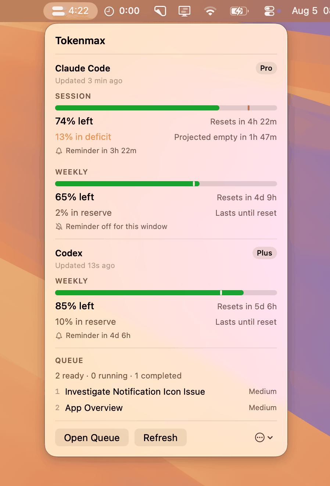
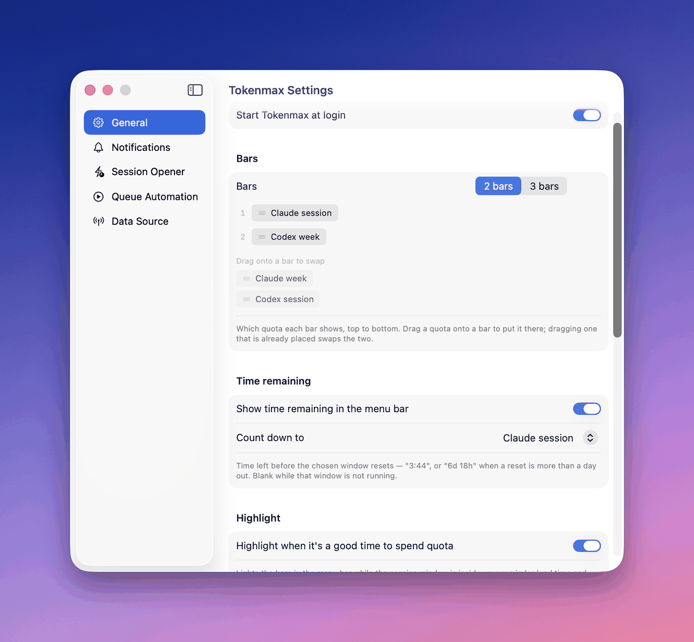
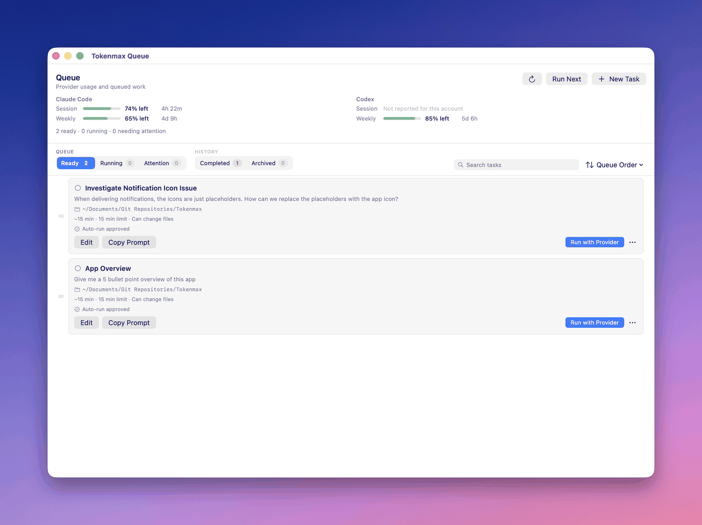
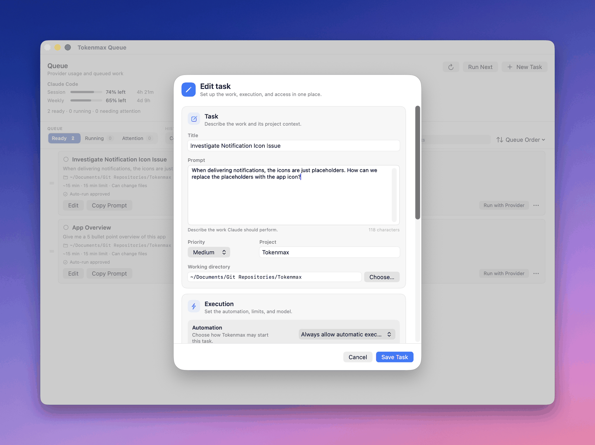

# Tokenmax handbook

The README explains what each feature *is* and why it behaves the way it does.
This is the other half: what to actually do, in the order you will want to do it.

Nothing here is required reading. Tokenmax works as a quota meter the moment you
launch it, and every other feature is off until you turn it on.

**Contents**

1. [The first ten minutes](#the-first-ten-minutes)
2. [Reading the meters](#reading-the-meters)
3. [Reminders that are worth receiving](#reminders-that-are-worth-receiving)
4. [Working the queue](#working-the-queue)
5. [Turning on automation without regretting it](#turning-on-automation-without-regretting-it)
6. [The session opener](#the-session-opener)
7. [Recipes](#recipes)
8. [Questions people ask](#questions-people-ask)

---

## The first ten minutes

**1. Launch it and answer the keychain prompt.**

macOS asks once for access to the `Claude Code-credentials` keychain item. That
prompt *is* Tokenmax reading your quota — decline it and the meters stay empty
(Tokenmax takes the no and stops asking until you click Refresh yourself).
Choose **Always Allow**, not *Allow*: only *Always Allow* records a grant, and
*Allow* covers only that read. Tokenmax's in-memory cache delays the next
question until it must consult the item again, normally after a relaunch,
expiry or rejected token.

If the prompt returns after every rebuild, that is expected for a locally built
copy and is not a bug. The README's [Building a
release](../README.md#building-a-release) section explains the one-time
certificate fix.

If you would rather never see the dialog at all, there is a
[recipe](#recipes) for that — status-line-only monitoring, at the cost of
background freshness and automation.

**2. Check the menu bar.**

You should see a stack of meters and a countdown. Out of the box that is two
bars — Claude session over Claude week — with the countdown showing time left in
the Claude session window.

<p align="center">
  
</p>

If you see a stub icon instead, the first reading has not landed yet. Give it a
few seconds. If it stays empty, jump to
[Troubleshooting](TROUBLESHOOTING.md#the-meters-are-empty-or-say-unknown).

**Right-click the icon** (or control-click it) for Settings, Open Queue, Refresh
and Quit without opening the popover first. Quit lives only here — there is no
Dock icon to quit from.

The version you are running sits beside the name at the top of the popover, and
in **Settings → About** with the build number. Tokenmax checks GitHub once a day
for a newer release and links to it when there is one; it never installs
anything itself. Switch the check off in the same place.

**3. Decide what the icon should show.**

**Settings → General** decides both halves independently. Under **Menu bar icon**,
pick the shape first — **Bars** or **Rings** — then say what each position shows
by dragging a quota — Claude session, Claude week, Codex session, Codex week —
onto the slot you want it on; dropping one onto an occupied slot swaps the two.
**Count down to** picks the window the countdown text tracks, which does not have
to be a window the icon shows. The text can also be switched off, leaving the
icon alone.

Bars are two or three stacked capsules and are the easiest to compare against
each other. Rings are nested arcs, two per ring: the outer arc encloses the
inner one, which is how a session sits inside a week. Rings are the only shape
that fits all four quotas, and the only one that costs real menu bar width —
about 35pt for two rings against 20pt for two bars. A single ring is 16pt, so
if you watch one provider, rings are the *narrower* choice.

<p align="center">
  
</p>

There is no wrong answer, but the countdown alone is the most legible at a
glance, and the icon alone is the least distracting.

**Putting the meters at the screen edge.** **Settings → General → Side Notch ·
Alpha** is a complementary view, not a replacement for the menu bar. Enable it
and move to the small handle halfway down the right edge. Hover opens one double
ring per provider; hover a ring for plan and freshness, the precise quota rows,
pace reserve or deficit, projected empty time and reminder state. Codex also
shows banked reset credits when it reports them. Click a ring to keep that card
open while the pointer moves, and again to release it. The surface follows the
display under the pointer, appears on every Space and over full-screen apps, and
does not take keyboard focus.

If Side Notch is the view you actually use, switch off **Show the menu bar
item** under **Menu bar icon**. Tokenmax permits that only while Side Notch is
enabled, so an accidental pair of off switches cannot make a menubar-only app
unreachable. Right-click the edge handle or open rail to restore the menu bar
item, refresh quota, or quit Tokenmax.

Provider order and outer/inner order are derived from the ring arrangement just
above the switch, but cross-provider menu-bar pairs are regrouped so each large
ring remains one provider. **Follow menu bar** keeps the colours in sync.
**Custom** starts as a copy of the current palette and keeps later edits to
itself, so experimenting never destroys either setup.

**Watching all four quotas at once.** Three bars is the ceiling, so this needs
rings. Switch the style to **Rings**, choose **2 rings**, and the default puts
each provider's week on its outer arc with its session inside. Two rings, four
numbers, no popover. A ring is not tied to one provider, though — if what
actually governs your week is the two weekly windows and you rarely bump a
session limit, drag both weeks onto the outer arcs and both sessions inside, and
the left ring becomes Claude-versus-Codex at a glance rather than two views of
one provider.

**Making it go red before it hurts.** Out of the box the icon is monochrome:
how much is left is carried by length, and colour only ever means "spend this
now" or "your reminder fired". If you would rather see a window getting low,
**Settings → General → Colour → Escalating** turns on a ladder of up to three
levels, each with a colour and a trigger.

A trigger is either a percentage or *that window's own reminder firing*, and the
difference matters more than it looks. A percentage is a fact about the quota,
so a level set that way outranks the "good time to spend" highlight — a window
with 15% left will not be painted green just because its reset is close. A
reminder is a fact about what you have already been told, so a level set that
way yields to the highlight: a window with 80% left that happens to have been
announced is still worth spending.

Two rungs is usually enough — one at the point you would start being careful,
one at the point you would stop starting new work. Leave **Base** on Neutral
unless you specifically want the healthy state to be coloured too: neutral is
what keeps the icon a template image that macOS tints to your menu bar, and a
colour there gives that up permanently.

**4. Add Codex, if you use it.**

There is nothing to configure. If the `codex` CLI is installed and signed in,
Tokenmax finds it and adds a Codex section to the popover on the next refresh.
It reuses the login the CLI already manages and never reads or stores those
credentials.

A **ChatGPT-managed** login reports quota windows. An **API-key** login is
billed and unmetered, so there is no window to report — Tokenmax labels it as
such rather than showing an empty meter, and will not start quota-gated
automatic Codex tasks against it.

If you do not use Codex, **Settings → Data Source** switches it off: its popover
section, its meters and its reminders all disappear. Nothing is deleted, so
switching it back on restores your arrangement.

**5. Grant folder access when you add your first task.**

If the project is in Documents, Desktop, Downloads or iCloud Drive, macOS asks
once. Say yes — the CLI cannot read your project otherwise.

One grant covers a whole area: allowing Documents covers every project under it.
Projects in `~/Projects` or `~/dev` never prompt, because those are not
protected. If your work is spread across several protected areas, **Full Disk
Access** (System Settings → Privacy & Security) is one grant instead of four.

This matters more than it looks — see
[before you turn on automation](#step-0--grant-folder-access-first).

**6. Stop here if you want.**

Everything above is read-only. Tokenmax has spent nothing, changed nothing, and
sent nothing anywhere except Anthropic's own usage endpoint. The rest of this
document is opt-in.

---

## Reading the meters

The bar carries **how much is left**. The countdown carries **how long there is
to spend it**. Those are different questions and the icon answers both because
neither is useful alone — 40% remaining is comfortable with four hours to go and
a waste with twenty minutes to go.

Under each meter is the pace line:

```
Session
▓▓▓▓▓▓▓▓▓▓▓▓░░░│░░░░░░░░░░░░
59% left                    Resets in 3h 34m
12% in deficit          Projected empty in 2h 4m
```

The `│` marker is where a perfectly even burn would have left you *right now*.

- **Ahead of the marker** — you have a reserve. You can afford a heavier session.
- **Behind the marker** — you are in deficit, and at this average rate the window
  empties before it resets.

"Projected empty" only ever appears next to a deficit, because that is precisely
the condition it describes. The two halves come from one comparison, so they
cannot contradict each other.

**When the meters light up**, the session window is inside your reminder lead time
and still holds usable quota. That is the app saying: this is the moment to spend
it, because it is about to evaporate.

Two silences are deliberate. Tokenmax says nothing about pace in the **first 3%
of a window** (dividing by near-zero makes one early prompt look like a runaway),
and it says nothing when the data is **stale** — carrying a last-good reading
forward is honest, extrapolating from it is not.

---

## Codex, and where it differs

Codex is a second provider, not a second copy of the first. It gets its own
meters, its own reminder thresholds and its own opt-in for unattended runs, and
none of those inherit from Claude. That is deliberate: the two have different
window lengths, different execution boundaries and different costs, so a setting
tuned for one would be wrong for the other.

**Meters.** Codex reports a weekly window. Some accounts report a session window
too; where one is not reported you get *"Not reported for this account"* rather
than a meter reading zero, because those are different facts. Its quotas can be
drawn in the menu bar like any other — **Settings → General**, drag *Codex week*
onto a bar.

**Banked resets.** If Codex has granted you a promotional reset, Tokenmax shows
its count and nearest expiry below the Codex meters. Treat it as a one-time
refresh of the eligible quota windows, not money or a larger subscription
allowance. Tokenmax deliberately does not redeem it; open Codex's usage summary
to review the offer and confirm it there.

**Reminders.** Codex's session and weekly windows each have their own lead time
and minimum remaining quota under **Settings → Notifications**. The session rule
only has a window to schedule against when the account reports one; on a
weekly-only account its status says so explicitly. Turning on a Claude reminder
does not turn on either Codex rule, and every threshold remains independent.

**Running tasks.** A task belongs to one provider. Codex tasks run through the
same App Server interface used to read quota, and the differences worth knowing
before you queue one:

| | Claude Code | Codex |
|---|---|---|
| Execution boundary | Per-tool allowlist, file tools scoped to the working directory | **Sandbox**: read-only, or workspace-write |
| Per-run cost cap | A USD ceiling Tokenmax enforces | **None** — the CLI offers nothing to enforce |
| Shell access | A separate per-task opt-in | Part of the sandbox choice |
| Thinking grades | `low` … `max` | `minimal`, `low`, `medium`, `high` — not the same set |
| Model | Alias or full id | Blank means *whatever your own Codex config selects* |
| Session opener | Yes | **Not available**, intentionally |

The missing USD cap is the one to sit with. For a Claude task you can say "stop
after a dollar"; for a Codex task the runtime limit is the only ceiling
Tokenmax can enforce, so set it deliberately rather than leaving the default.

**Unattended runs — not in 0.1.** Codex automation is gated behind its own
setting, separate from Claude's, so that enabling unattended Claude runs never
silently grants a second unattended agent. That setting defaults to off and
**this build exposes no control for it**, which means Codex tasks never start on
their own. Queue them and run them yourself with **Run with Provider**; the
scheduler will not pick them up.

Claude automation is unaffected — it has its own switch under **Settings → Queue
Automation** and works as documented.

**Switching it off.** **Settings → Data Source** stops polling Codex, hides its
section and meters, cancels its pending reminders and refuses to auto-run its
tasks. It hides rather than deletes: your rules, icon layout and Codex tasks stay
on disk and come back exactly as they were.

---

## Reminders that are worth receiving

**Settings → Notifications.** Permission is requested here, never at launch.

**Quota reset confetti** is separate from reminders: reminders ask you to use quota before it
expires, while confetti marks quota that has already returned. Turn it on, then choose **Always**
or **Specific events** and select the provider/window combinations worth celebrating. Tokenmax
waits for a fresh reading that proves a successor window is active, and does not show the overlay
during quiet hours. Click **Preview Confetti** to exercise the same overlay immediately. Preview is
an explicit action, so it works before you enable automatic celebrations and during quiet hours.

The single decision that matters is **lead time**: how long before a reset you
want to hear about leftover quota. Too short and there is no time to use it; too
long and you get told about a window you are still actively using.

A practical starting point: **45–60 minutes for the session window**, and **a few
hours for the weekly**, since a week's leftovers need a longer runway.

Codex session reminders are off when first introduced, including on an upgrade
where global reminders are already enabled. Opt in to that individual rule once
you have chosen a threshold; weekly-only plans keep the choice for a future plan
change but cannot schedule it without a reported session window.

Then set **minimum quota** — below this, staying quiet is the right answer. There
is no point being told that 4% remains.

Two behaviours worth knowing before you tune anything:

- **Changing a rule re-arms the current window.** If a reminder already fired
  under a four-hour lead and you change the lead to 45 minutes, the window
  re-arms rather than staying suppressed under a rule you just replaced.
- **Stale data never cancels a scheduled reminder.** A run of failed refreshes
  cannot silently leave you with nothing.

If a reminder does not arrive, every suppression is logged with its reason —
see [Troubleshooting](TROUBLESHOOTING.md#a-reminder-did-not-arrive).

---

## Working the queue

The queue is a list of prompts you have not run yet. Its point is that leftover
quota is only useful if you have something ready to spend it on.

<p align="center">
  
</p>

**Add a task** with ⌘N. The fields that matter:

<p align="center">
  
</p>

| Field | Why it matters |
|---|---|
| **Prompt** | The work itself. |
| **Working directory** | Where it runs. Also the boundary file tools are confined to. |
| **Runtime estimate** | Required for automation. Without it the task can only be run by hand. |
| **Runtime limit** | Hard ceiling. The run is killed here. |
| **Spend limit** | Enforced by the CLI itself via `--max-budget-usd`. Pick a preset or type any amount under **Other…**. It applies per run, so a reply in the thread view gets the same allowance again. |
| **Automation** | Whether Tokenmax may ever start this on its own. |
| **Schedule** | Optional. Runs the task once at a set date and time instead of waiting for a burn window, opening a session if none is running. Overrides the timing only — every quota and safety guard still applies — and expires if missed. |

Two ways to run a card:

- **Run with Provider** — headless, streams to a log, result viewable in-app.
- **Open in Terminal** (under ⋯) — validates the directory, copies the prompt,
  opens your terminal there, hands over. Nothing is executed for you.

**View Result** shows the final answer first, then any tools the run *denied* —
that is usually why a run looks like it under-delivered — then the steps it took.
The raw NDJSON is one click away under **Raw Log**.

### Replying to a run

`claude -p` cannot ask a question and wait. When a run needs a decision it says
so and exits. The result sheet's **reply box** continues that same conversation
with the task's own model, permissions, and limits unchanged.

This matters most for a run that happened while you were away: it stopped on an
ambiguity at 3am and the thread is still there in the morning.

Two consequences of how the CLI works: each turn replays the whole conversation
as context, so a long thread costs progressively more (the running total is in
the header), and transcripts are stored per working directory, so changing a
task's directory makes its earlier threads unreachable.

---

## Turning on automation without regretting it

This is the feature that spends your money without asking. Treat it accordingly.

### Step 0 — grant folder access first

The failure mode this prevents is the worst one the app has: an automatic run
starts at 3am, macOS asks for permission to read the project folder, nobody is
awake to answer, and the run blocks until its runtime limit kills it. No output,
no transcript, and the queue paused behind it.

Nothing about it looks like a permissions problem from the outside, which is why
it is worth ruling out before you rely on unattended runs at all.

Open each automatic task once and confirm no permission warning appears under the
working directory. Or grant **Full Disk Access** and stop thinking about it —
System Settings → Privacy & Security → Full Disk Access → **+** → Tokenmax.

Check it landed with `make logs`: the launch probe records `access: ok` or
`access: DENIED` for every folder your tasks live in.

### Step 1 — run it in preview for a few days

**Settings → Queue Automation** starts in **preview only** even after you switch
it on. Preview evaluates every condition and tells you what it *would* have done,
spending nothing.

Leave it there for a few days. You are checking one thing: does it want to run at
moments you would also have chosen? If it keeps proposing runs at times that feel
wrong, the thresholds are wrong, and finding that out for free is the entire point
of the mode.

### Step 2 — write tasks that are safe to run unattended

A task suitable for automation is one where a bad outcome is *cheap*. Good
candidates:

- generating tests for existing code
- writing documentation from source
- refactors that are fully covered by a test suite
- research and summarisation that only reads

Poor candidates: anything touching credentials, anything whose failure mode is a
force-push, anything that needs a judgement call you would want to make yourself.

### Step 3 — set the capability toggles deliberately

**Allow file changes** confines file tools to the working directory using
`Write(**)`-style path scoping. Without that scoping an allowlisted `Write` is
auto-approved for *any* path on the machine, which is why it is scoped.

**Allow shell commands** is a separate opt-in precisely because it removes that
confinement — a shell command can reach the whole machine. Turn it on per task,
not by habit.

`--dangerously-skip-permissions` is never used, by anything, ever.

### Step 4 — decide about Codex separately

Everything above was about Claude. Codex has its own switch under **Settings →
Queue automation → Codex**, and it stays off until you set it, including through
an upgrade — trusting one agent to run unattended is not the same decision as
trusting two, and inheriting the second one silently would be exactly the wrong
default.

Two things differ once it is on. Codex's execution boundary is a **sandbox**
rather than a tool allowlist, so *read-only* and *workspace-write* are the whole
decision — there is no separate shell toggle to forget. And Codex reports no
per-run cost, so there is no spending limit to set; the runtime limit and the
sandbox are what bound a run.

The setting most worth a second look is **maximum tasks per window**. If your
plan reports only a weekly Codex window — the Codex section says which one yours
reports — then Tokenmax spends that window, and the default of one task per
window means one task a *week*. That is a reasonable place to start and a poor
place to stay.

### Step 5 — go live conservatively

Defaults worth keeping at first: **one task per session window**, **stop on the
first failure**, and never starting a second task until a usage reading newer
than the first one lands.

A task runs automatically only when *all* of this holds — the task is marked
**Always allow automatic execution**, its working directory exists, it has a
runtime estimate, the reading is fresh, both quotas are above threshold, the
window is inside the lead time, no other run is in flight, the per-window
budgets have room, and the task's **runtime limit** fits before the safety
margin. When something blocks a run, the popover and Settings name which
condition failed.

A task given a **Schedule** answers the timing question by itself: it runs at
that moment wherever the session is in its cycle, and opens one if none is
running. Everything else in the list above still has to hold, which is why the
first appointment most people set does not fire — the task was never marked
**Always allow automatic execution**. It also runs once and expires if it is
missed, since nothing evaluates while the Mac is asleep; **Settings → Queue
Automation → Timing** decides how late is too late.

---

## The session opener

A Claude window starts on **first use**, not on a schedule. The opener sends one
tiny request after a reset so the next window is already running when you sit
down later.

**Switch this on only if you want a window open at a predictable later time.**
Opening one early also starts its five-hour clock — that is the trade, and it is
why the feature ships off.

Two of its rules are invariants rather than settings: **all tools are always
disabled**, and it **never runs under an API key**. A switch for either would
only be a way to turn the safety off.

Use **Check eligibility** in Settings to see every guard evaluated against the
current state. It spends nothing.

---

## Recipes

**"I want quota visible without spending menu-bar width."**
Turn on **Side Notch · Alpha**, then switch the menu bar to its smallest useful
form — or hide the menu bar item completely. Leave Side Notch colours on
**Follow menu bar** at first. Hover the edge handle for a glance, and click the
provider you are actively using when you want its reset rows to stay open. If
you move between displays, the collapsed handle follows the pointer
automatically. Right-click it whenever you need the menu bar item back.

**"I want to know when quota is about to be wasted, and nothing else."**
Enable reminders, set a 45-minute session lead. Leave the queue, automation and
opener off. This is Tokenmax as a pure meter with an alarm.

**"I want a backlog ready for leftover quota, but I will start each run myself."**
Enable the queue. Leave automation off. Add tasks as they occur to you, and when
a reminder fires, hit **Run Next**.

**"I want overnight work on a fixed budget."**
Enable the queue and automation. Mark two or three low-risk tasks as automatic,
each with a runtime estimate, a runtime limit, and a spend limit you would be
content to lose. Keep *pause after first failure* on. Leave shell access off
unless a specific task genuinely needs it.

**"This one job has to happen on Friday afternoon, not whenever a window closes."**
Give the task a **Schedule**, and mark it **Always allow automatic execution**
with a runtime estimate like any other unattended task — the date replaces the
burn window, not the approval. Set it for a time the Mac will be awake and
unlocked; an appointment that comes round during sleep is abandoned rather than
run late.

**"I want a window already warm when I start work at 9am."**
Enable the session opener with a delay that lands it before you sit down. Accept
that the five-hour clock starts when it fires, not when you arrive.

**"I want the meters, and macOS must never show me a keychain dialog."**
Install the status-line shim from **Settings → Data Source**, then switch the
data source to **Status line only**. The keychain is never read, so there is
nothing for macOS to ask about. The trade: readings update only while a Claude
Code session is answering, the per-model weeklies and plan name disappear, and
the opener and automatic task runs pause — a mode that cannot poll cannot
confirm what an unattended run just spent. Running a task by hand still works.
Install the shim *before* switching, or the meters will simply say unknown.

---

## Questions people ask

**Does Tokenmax send my prompts anywhere?**
No. The only network requests it ever makes are to `api.anthropic.com` for quota,
using the token Claude Code already stored. Prompts stay on your Mac and are
passed to the local CLI. There is no telemetry, no analytics, no server.

**Will this get my account flagged?**
It reads a usage endpoint your own client already calls, floored at one request
per 180 seconds — far below normal client traffic. It is your account and your
plan, and the disclaimer in the README is the honest statement of the position:
satisfy yourself that how you use it fits Anthropic's terms.

**Why does the quota sometimes disagree with what Claude Code shows?**
Two sources with different freshness. The usage endpoint can be polled any time;
the statusline only updates while a session is running. In the default keychain
mode, when both are available the fresher, higher-confidence reading wins; in
status-line-only mode there is just the one source, as fresh as your last
session response.

**Can I use this with an API key instead of a subscription?**
For quota display, no — there is no window to report; API-key billing is metered
per token. Tokenmax labels that state as billed and unmetered and refuses to
start quota-gated automatic work under it.

**Will it ask for folder permission for every project?**

No — once per protected *area*, not per folder. Allowing Documents covers every
project under it forever. Desktop, Downloads and iCloud Drive are separate grants,
asked the first time you use each. Anywhere unprotected — `~/Projects`, `~/dev`,
`/Users/Shared` — never asks at all.

If it stops asking entirely, that is the expected end state: macOS asks once per
app and remembers. A prompt reappearing later means the app's identity changed,
which for a locally built copy means it was rebuilt — see [Building a
release](../README.md#building-a-release).

**What happens if my Mac is asleep?**
Reminders are delivered by macOS on wake rather than at the scheduled instant.
The opener fires shortly after wake. Neither is something an app can work around.

**Does any of this survive a crash?**
Yes. All writes are atomic, the opener records its cycle *before* spawning
anything (so a crash cannot produce a second opener), and runs found unfinished
at launch are marked interrupted rather than silently retried.

**How do I get rid of it completely?**
Quit, delete `/Applications/Tokenmax.app`, and remove
`~/Library/Application Support/Tokenmax/`. If you installed the statusline shim,
delete the `statusLine` key from `~/.claude/settings.json`.
